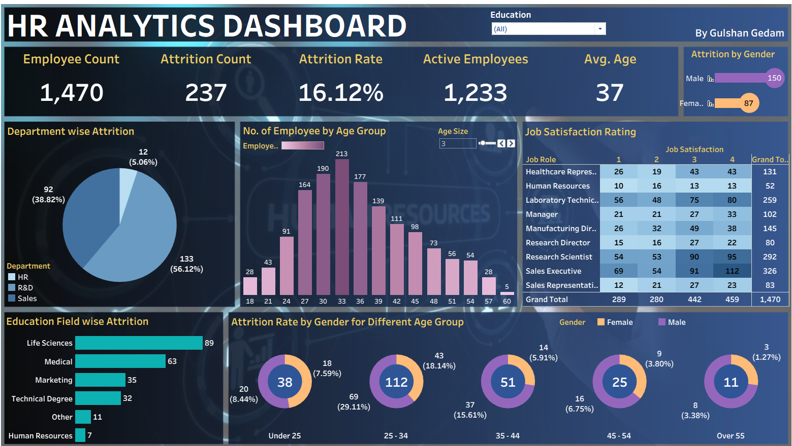

# HR Analytics Dashboard (Tableau)

## Overview

This project presents an interactive **HR Analytics Dashboard** built using **Tableau** to analyze workforce demographics, employee attrition, and job satisfaction trends.

The dashboard transforms raw HR data into meaningful visual insights that help organizations monitor employee turnover, identify high-risk attrition groups, and support data-driven workforce planning.

---

## Objective

The primary goal of this dashboard is to help HR teams and business leaders answer key workforce questions such as:

* What is the overall employee attrition rate?
* Which departments experience the highest attrition?
* Which age groups are most affected by attrition?
* How does attrition vary by gender and education field?
* How satisfied are employees across different job roles?

---

## Tools & Technologies

* **Tableau**
* Data Cleaning & Transformation
* Interactive Dashboards
* Data Visualization
* HR Analytics

---

## Dataset

The dataset contains employee-related information including:

* Employee ID
* Age
* Gender
* Department
* Job Role
* Education Field
* Attrition Status
* Job Satisfaction Rating
* Employee Demographics

---

## Key Performance Indicators (KPIs)

The dashboard tracks the following HR metrics:

* **Employee Count:** 1,470
* **Attrition Count:** 237
* **Attrition Rate:** 16.12%
* **Active Employees:** 1,233
* **Average Age:** 37

---

## Dashboard Components

### 1. Employee Overview

Provides a high-level summary of the workforce through KPI cards such as employee count, attrition count, and average age.

### 2. Department-wise Attrition

Visualizes attrition across departments to identify areas with high employee turnover.

Key departments analyzed:

* Sales
* R&D
* HR

---

### 3. Age Group Distribution

Shows employee distribution across age groups to understand workforce demographics.

This helps identify:

* dominant age groups
* age concentration
* workforce maturity

---

### 4. Job Satisfaction Analysis

A heatmap showing satisfaction ratings across job roles.

This helps uncover:

* low-satisfaction job roles
* potential attrition risk areas
* employee engagement patterns

---

### 5. Education Field-wise Attrition

Analyzes attrition by educational background.

Fields include:

* Life Sciences
* Medical
* Marketing
* Technical Degree
* Human Resources

---

### 6. Gender-wise Attrition by Age Group

Shows attrition differences between male and female employees across age groups using donut charts.

Age groups analyzed:

* Under 25
* 25–34
* 35–44
* 45–54
* Over 55

---

### 7. Interactive Filters

Dashboard supports dynamic filtering using:

* Education

This enables deeper segmentation and targeted analysis.

---

## Key Insights

* Overall attrition rate is **16.12%**
* Sales department shows the highest attrition among departments
* Employees aged **25–34** experience the highest attrition
* Life Sciences contributes the largest attrition among education fields
* Job satisfaction varies significantly across job roles

---

## Skills Demonstrated

This project showcases:

* HR Analytics
* Data Cleaning
* Dashboard Design
* Data Storytelling
* KPI Development
* Business Insight Generation
* Tableau Visualization

---

## Business Value

This dashboard helps organizations:

* Monitor employee turnover
* Identify attrition risk groups
* Improve retention strategies
* Analyze workforce demographics
* Support strategic HR decisions

---

## Dashboard Preview

---

## Future Improvements

Potential enhancements:

* Predictive attrition modeling using machine learning
* Salary-based attrition analysis
* Employee tenure analysis
* Retention forecasting

---

## Author

**Ebin Joshy**

Aspiring Data Analyst | Excel | SQL | Python | Tableau

